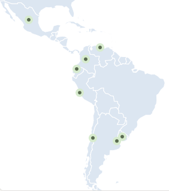

Biblioteca de componentes de React para Telefónica Hispam ([Kénos](https://github.com/TelefonicaAR/kenos-ui))


## ¿Qué es Kénos?
Esta es una colección de componentes gráficos para React que te permiten construir aplicaciones web modernas y atractivas con facilidad destinado para [Telefonica Hispam](https://www.linkedin.com/company/movistar-telefonica-hispam/about/). 

## ¿Qué puedes encontrar en Kénos?
Desde botones hasta gráficos y tablas, la librería Kénos ofrece una amplia variedad de componentes altamente personalizables y fáciles de usar que te ayudarán a mejorar la usabilidad y el atractivo visual de tus proyectos de React.



## Para comenzar a trabajar
Solamente con los comandos de instalación en tu proyecto React podrás utilizar esta librería.
### Instalación

```terminal
yarn add @telefonica/kenos
```

o si utilizas npm 

```terminal
npm install @telefonica/kenos
```

## Para utilizar el storybook 
Para explorar todos los componentes, Kénos tiene un storybook que presenta de manera detallada sus diversas formas y comportamientos.
### Instalación

```terminal
> yarn install
```

```terminal
> yarn storybook
```

## Para incorporar componentes

Antes de usar cualquiera de nuestros componentes, debes agregar `<ThemeContextProvider>` en la raíz de su aplicación React.
Aquí hay un ejemplo completo de un formulario con dos campos de texto y un botón de envío:

```javascript
import {createRoot} from 'react-dom/client';
// Import Kenos styles. Depending on the bundler you use, you may need to import it in a different way.
import '@telefonica/kenos/css/kenos.css';

// Use kenos components
import {
  ThemeContextProvider,
  Form,
  Box,
  Stack,
  TextField,
  EmailField,
  ButtonLayout,
  ButtonPrimary,
  alert,
  getMovistarSkin,
} from '@telefonica/kenos';

const App = () => (
  <Form
    onSubmit={(formData) =>
      alert({
        title: 'This is your data',
        message: JSON.stringify(formData, null, 2),
      })
    }
  >
    <Box padding={16}>
      <Stack space={16}>
        <TextField name="name" label="Name" />
        <EmailField name="email" label="Email" />
        <ButtonLayout>
          <ButtonPrimary submit>Send</ButtonPrimary>
        </ButtonLayout>
      </Stack>
    </Box>
  </Form>
);

const kenosTheme = {
  skin: getMovistarSkin(),
  i18n: {locale: 'es-ES', phoneNumberFormattingRegionCode: 'ES'},
};

const container = document.getElementById('app');
const root = createRoot(container);
root.render(
  <ThemeContextProvider theme={kenosTheme}>
    <App />
  </ThemeContextProvider>
);
```

El prop `theme` en `ThemeContextProvider` es **obligatorio**, y puedes usarlo para configurar algunos aspectos de
la biblioteca. Hay múltiples configuraciones, pero los únicos dos campos obligatorios son `skin` e `i18n`. Leer el [theme config doc](doc/theme-config.md) para más información.

:advertencia: Por lo general, el objeto `theme` es constante y no necesitará cambiar dinámicamente en su aplicación, en
ese caso recomendamos extraerlo a una variable `const` externa fuera del componente, de esta manera en
la referencia del objeto será la misma en cada renderizado. Si por alguna razón el `theme` debe ser dinámico en su
app, considera memorizarla (por ejemplo, con el hook `React.useMemo`).


## Desarrollo

- `yarn test`: run tests
- `yarn test-acceptance`: run acceptance tests headless (you need to start storybook first)
- `yarn test-acceptance --ui`: run acceptance tests with ui (you need to start storybook first)
- `yarn lint`: check codestyle
- `yarn ts-check`: check static types
- `yarn build`: build package
- `yarn storybook`: starts storybook
- `yarn playroom`: starts playroom


## GitFlow

PENDIENTE - Aqui se detallarán los pasos que se deben seguir para crear/modificar/borrar un componente de esta liberia 
## Buenas Prácticas

PENDIENTE - Aqui se detallarán las buenas practicas que se deben llevar a cabo 

## Sistema de Iconos

Los iconos se manejan por separados en el repositorio de ([kenos-icons](https://github.com/TelefonicaAR/kenos-icons)).

PENDIENTE - Aqui se puede detallar los pasos a seguir para crear un nuevo icono. 
